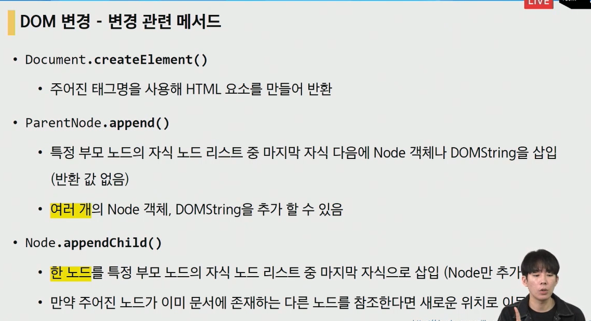
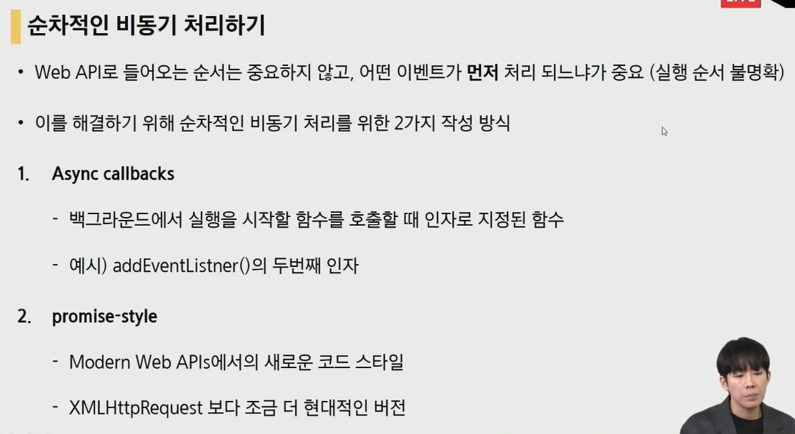
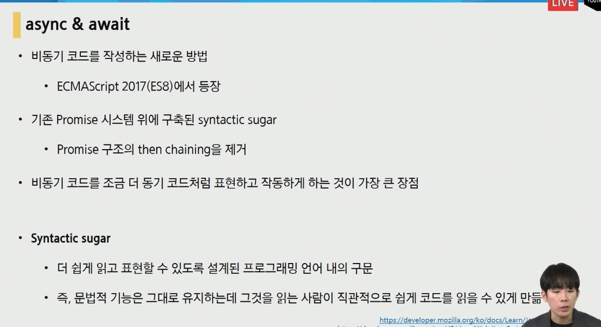

# JS

JS는 많은 역사와 Version들이 있지만 돌고 돌아서 제일 순정파인 Vanila Js로 돌아오게 됨
JS는 브라우저를 조작하는 언어!

## 브라우저에서 할 수 있는 일
- DOM(Document Object Model) 조작 -> 문서 조작
  - HTML, XML 등과 같은 문서를 다루기 위한 문서 모델 인터페이스
  - 문서가 구조화되있고 각 대상이 객체로 취급됨
  - 트리 모양으로 구조화 되있어서 단계별로 handling하기에 용이함
  - 브라우저는 문자열(vs code는 사실 메모장과 차이가 없음)을 Parsing 해서 DOM Tree로 만들어줘야함
  - 주요 객체
    - window: DOM을 표현하는 창으로 최상위 객체
    - document: Body와 같은 많은 요소들 포함
    - nav, history, screen..
  - 선택 메서드
    - Document.querySelector(): 하나 선택
    - Document.querySelectorAll(): 전부 선택
- BOM 조작(Nav, screen, history) -> 브라우저 객체 조작
  - DOM 외의 부분(URL창, 뒤로가기, 프린트, 타이틀바 이런 것들)
- JS Core(Object, Arr) -> 프로그래밍 언어로써의 역할

JS는 브라우저를 조작할 수 있고 브라우저는 위의 3가지를 조작할 수 있습니다.

### DOM 선택

id는 #, class는 . 

되도록 id, class 를 기준으로 선택하자(h1, h2,과 같은 경우는 헷갈릴 수 있음)

### DOM 조작

### DOM 속성

innerHTML은 취약할 수 있음

setAttribute() 괄호가 있으므로 속성이 아니라 매서드

### 정리:

선택할땐 최대한 queryselector, queryselectorAll로만 하는게 좋음

## Event

target.addEventListener(type, listener)

target 대상을 (type이 클릭이라고 했을 때) 클릭이 발생했을 때 listener 라는 함수를 호출하며 실행함

listener 함수에 event 는 무조건 인자로 받아옴

## callback Function

파이썬에 함수를 사용할 땐 보통

1. 함수 생성
2. 함수 실행

이라는 과정이다.

그러나 JS에서 Callback Function이라는 것이 있는데

1. 특정 event가 발생하면 함수를 생성하고 실행한다

로 프로세스가 2 & 1 로 합쳐진 느낌이다.

## PreventDefault

이벤트를 중단시키지는 않지만 이벤트의 결과는 중단시킴...?

## Live Collection VS NON-Live Collection(Static Collection) 

04_collection.html 참조

## JS Style Guide

https://github.com/airbnb/javascript

## 변수와 식별자

- 클래스 명 외에는 모두 소문자로 사용

## AJAX(asynchrononus XML)

사용자의 Event가 있다면 전체 페이지가 아닌 일부분만 비동기식으로 JSON 으로 통신하는 기법

JS를 JSON을 통해 비동기식으로 작동하게 해주는 역할이라고 생각하면 편할 것 같습니다.

- Google Maps 와 Gmail 생각해보면 지도 확대, 메일 보내기 했을 때 화면은 안바뀌고 특정부분만 변함

## Synchronous VS Asynchronous(동기 vs 비동기)

JS는 동기적 언어이지만 필요에 의해서 비동기식으로 일을 할 수 있습니다.

비동기식의 장점으론 아래의 사진에서와 같이 사용자 경험을 향상시킵니다.

JS는 single thread로 한번에 하나의 작업만 수행할 수 있고 다음 작업을 수행하려면 앞의 작업이 완료되어야 합니다.

동기식 예시(alert 팝업 확인을 누르기 전까지 다음 동작들을 수행하지 못하고 있습니다)

비동기식 예시로 웹페이지 응답을 기다리지 않고 출력해서 Null 이 나오게 됩니다.

위의 두 동기식, 비동기식 문제의 원인으로는 JS가 Single thread이기 때문에 한 번에 하나의 작업만 수행할 수 있고 다음 작업을 수행하려면 앞의 작업이 완료되어야 합니다.

즉 single thread 라는 단점을 보완하기 위해 위의 과정, 즉 concurrency model(동시성 모델)을 채택하였습니다.

call stack(main thread)와 web api(브라우저) 가 있기 때문에 single thread 라는 단점을 극복하고 두 개 이상의 thread가 일하는 것처럼 할 수 있습니다.

1. HI 가 call stack 에 들어갔다가 output 출력됨
2. setTimeout 이 call stack에 들어갔다가 바로 처리가 되지 않아서 Web API로 들어가고나서 3초 이후에 Task Queue로 들어가게 됨
3. Bye 가 call stack 에 들어갔다가 output 출력됨
4. setTimeout이 web API 들어가고나서 3초 후에 Task Queue로 들어가고 Event Loop는 call stack 이 비어있는지 계속 확인해주므로 call stack으로 들어가고 출력하게 됨
5. 만약 3000이 아니라 0 이여도 call stack이 비어있어야 Task Queue에서 들어갈 수 있는건 동일하므로 출력 순서는 똑같다~

요약: JS는 Single thread이며 동기적인 언어라는 한계를 극복하기 위해 비동기적 방법을 도입하였으나 위에서 살펴본듯이 비동기 작업은 순서가 보장되지 않는다라는 한계가 있습니다.

## 비동기 순차적으로 처리하기

### Callback Function

함수안에 인자로 들어갈 수 있는 함수를 callback function이라 부를 수 있음(동기, 비동기와는 관련 X)

비동기식으로 돌아가는 콜백함수는 동기식과 다르게 백그라운드에서 대기하고 있다가 특정한 event(click) 를 만나고 나서야 동작을 수행합니다.

이런 콜백함수를 쓰는 이유는 함수 호출을 명시적으로 하는게 아니라 event 중심으로 호출할 수 있기 때문입니다.

비동기로직은 우리가 코드를 짤 때 명시적으로 표시를 해주지 않고 특정 시점에 이벤트에 의해 호출되어야 하기 때문에 콜백함수가 필요합니다.

그러나 callback 함수는 연쇄가 끝이 없을정도로 길어질 수 있습니다.

이런 콜백지옥에서 탈출시켜줄 약속 Promise 의 등장

### Promise

비동기 작업이 성공, 실패하면 콜백함수 실행

비동기작업의 결과값이 콜백함수의 인자로 들어감

queue 구조를 통해 순서대로 chaining 되며 실행되는 게 promise 구조의 최대 장점

#### AXIOS(Promise based HTTP client for the browser and Node.js)

브라우저를 위한 Promise 기반의 요청에 특화된 클라이언트입니다.

AJAX 요청을 원래는 XHR 브라우저 내장 객체로 해결햇는데

이것을 더 편리한 Promise 기반으로 가능하도록 도움을 주는 친구입니다.

then 어디선가 실패하면 바로 catch error로 들어가서 error 발생

설치방법

https://github.com/axios/axios

### Async & Await

callback 지옥에서 빠져나와 Promise를 구축했지만 Promise 도 then 이 너무 반복적으로 사용되서 최근에 나온 구조입니다.

## AJAX ~ Async & Await

즉 JSON데이터의 비동기 처리를 위한 여정이었습니다.

